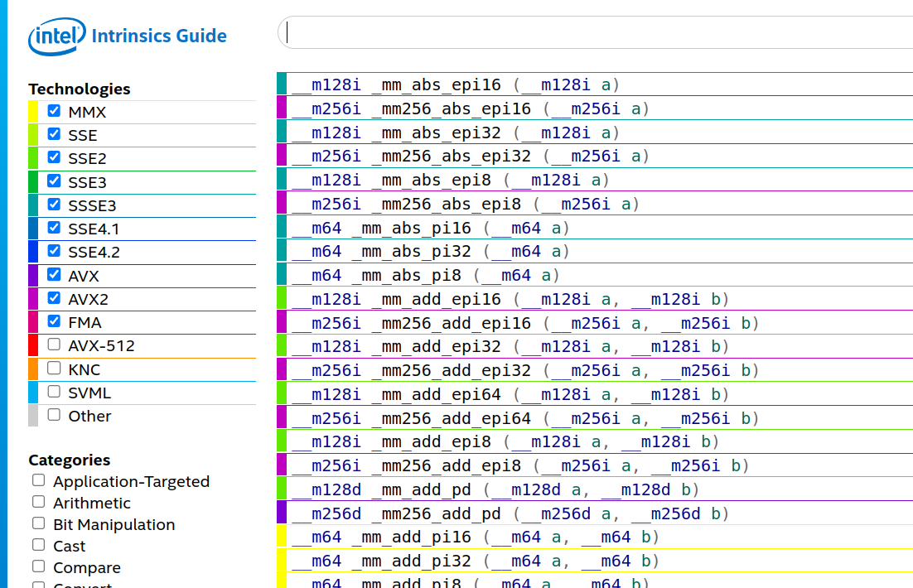

# 💥Dimas Mandelbrot💥

## Описание

Этот проект является частью курса Системного Программирования в МФТИ.
В нем я хотел показать, как в **Linux** с помощью знания **AVX** команд можно оптимизировать программы.

## Программа для оптимизации (Множество Мандельброта)

Используя **C++** и библиотеку **SFML**, я написал программу, которая динамически высчитывает множество Мандельброта и рисует его на экране.
Выглядит это следующим образом:

Вычисление множества **Мандельброта** является непростой математической задачей. Работая с каждой точкой множества по отдельности, мы получаем весьма затратные вычисления, на которые наш компьютер, даже с флагом оптимизации **-О3** тратит приличное количество времени :(.

Но, можно заметить, что алгоритм в данной задаче позволяет нам работать с несколькими точками одновременно. Этим мы и воспользуемся!

## AVX инструкции

**Intel** предоставляет нам широкий набор **AVX** инструкций, которые позволяют нам использовать возможности нашего процессора на максимум и одновременно работать с массивом из 8 точек (это максимум, на который способен мой процессор)!

Применим эти инструкции и посчитаем, во сколько раз нам удалось ускорить нашу программу.

## Результаты

Замеры времени я производил с помощью ASM команды **rdtsc**. Тактовая частота моего процессора ~3000MGz.

|           | Без Оптимизаций |  -O3 | AVX инструкции | AVX инструкции + -O3 |
|-----------|:---------------:|:----:|:--------------:|:--------------------:|
| Время, мс |      15,39      | 6,50 |      4,90      |         1,17         |
|    FPS    |        6        |  16  |       20       |          100         |

Итого, мы ускорили наши вычисления в **5,5 раз**!

💘 **Dmit DREC MIPT 2024**
